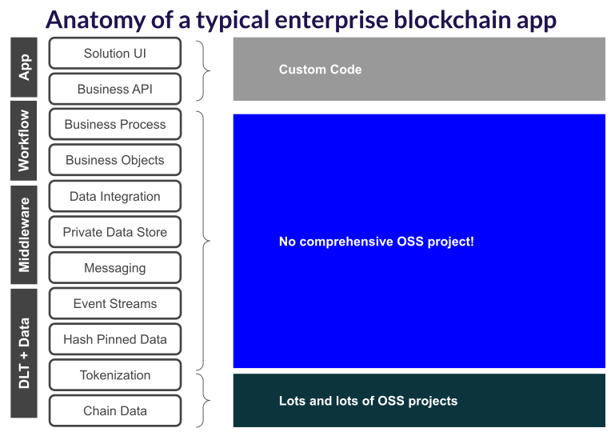
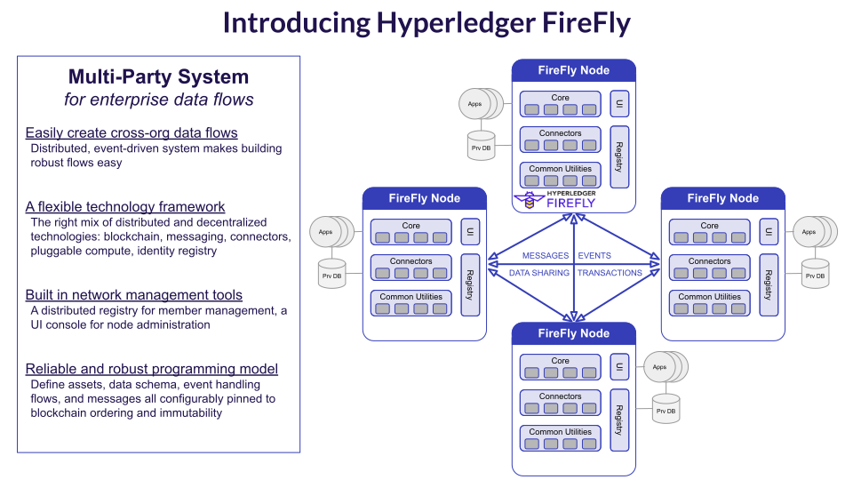
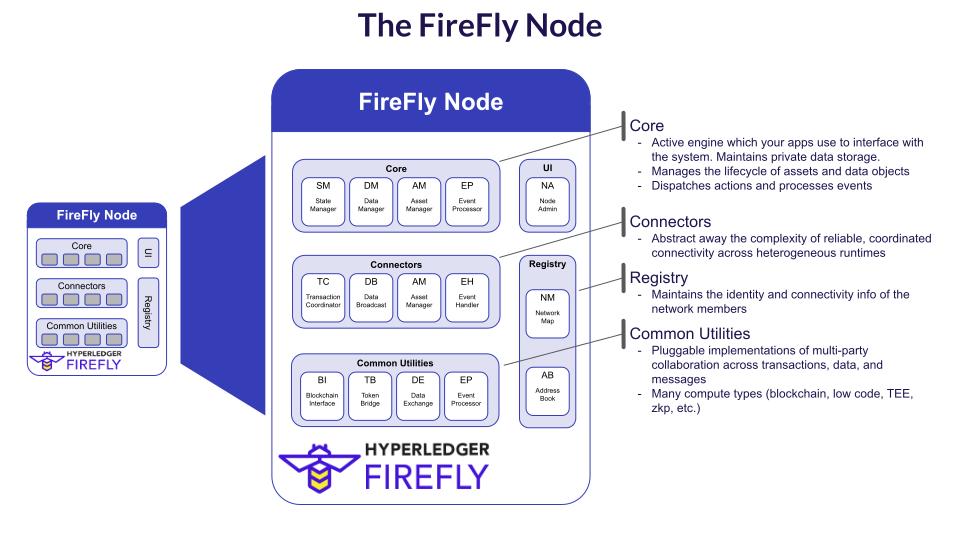
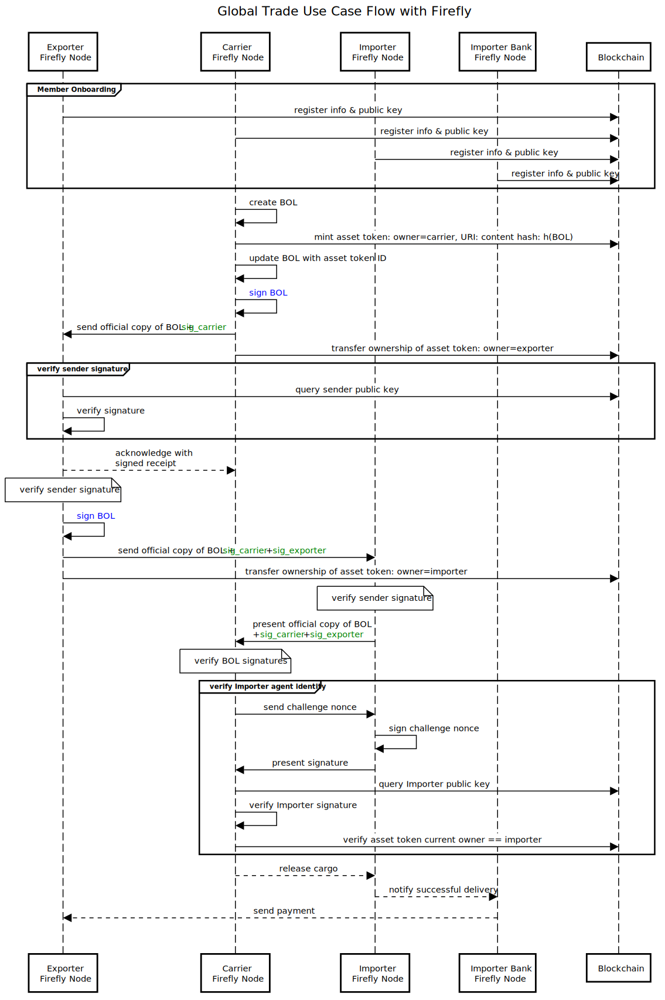
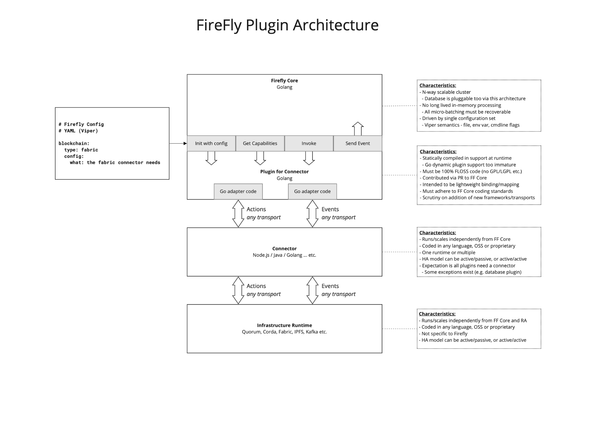

# 🪰 FireFly

FireFly is a multiparty system for enterprise data flows, powered by blockchain. Enterprise use cases often require a mix of off-chain and on-chain activities to implement a use case end-to-end. FireFly provides a set of pre-integrated runtimes and an API to build event-driven, multi-party applications with a combination of off-chain data flows and on-chain transactions.

:::note
Your Gateway to Web3 Technologies
:::

## Requirements of a multi-party system

(1) the single source of truth coordination system across parties

(2) per-member plumbing software to enable reliable,

private integration to and from the coordination system
(3) cross-org plumbing software that provides robust cross-connectivity among members alongside (1) for use when the coordination system is not suitable or not preferred as the data flow mechanism. 

Examples include sensitive data, low latency messaging, and large data flows
(4) a control plane to manage all of these runtime and configuration details
We define a multi-party system as the set of technology, infrastructure, and management capability to enable a consortium to build and deploy a use case which

 includes (1), (2), (3), and (4). 

We observe that nearly all real world consortia, regardless of industry sector, require (1), (2), (3), and (4) to build and deploy an enterprise blockchain use case. In our experience, consortia spend a huge amount of their resources building out the plumbing portion of the system. Furthermore, it is our observation that companies spend most of their budget on (2) and (3).

FireFly brings together (1), (2), (3), and (4) to offer a pre-integrated set of runtimes via a highly pluggable framework. 

Note that FireFly is NOT attempting to replace or invalidate any specific runtime technology, but rather pulls together multiple complementary technologies into a coherent, larger system. Indeed, many of the infrastructure runtimes FireFly relies on are separate open source projects.

Enterprise blockchains are purposely built to deliver 
(1) with invaluable attributes like global ordering and finality. FireFly will support Hyperledger Fabric, Enterprise Ethereum (such as Quorum and Besu), and will investigate Corda compatibility. 

(1) also includes global storage providers such as IPFS. FireFly also provides a significant amount of technology for 

(2) and (3) including cross-party messaging, cross-party private document transfer, and event propagation. All of these runtimes and connectors into the FireFly node. For (4), FireFly also provides a network map and registry that unifies all of the identity and bindings information needed.

- [FireFly Docs](https://hyperledger.github.io/firefly/v1.2.0/tutorials/)  

- [Butane.io](https://butane.tech)

## The problems it solves

When building a system for multiparty business transactions based on blockchain technology, there are a number of problems that need to be solved. Problems such as:

- How do parties agree on standardized data types?

- How do I securely send private data between two parties in the system without other parties being able to view the data?

- How do I run business processes in response to blockchain transactions?

- How do I leverage blockchain technology, but not expose sensitive data stored on-chain?

- How do I process events originated from multiple parties in the correct order that is uniformly honored throughout the decentralized system?

Blockchain plays a key role in the solution for each of them, but it's not always obvious how to best utilize blockchain, 

or the solution can be quite complex. Today, there is no comprehensive OSS project that makes it easier and more reliable to solves these common problems. 

FireFly fills this gap, and allows businesses to focus on solving business problems.

The gap includes functionality such as registering and verifying member identity within the network

 ( note that member identities needed in the app layer are not always on-chain member identities defined in the blockchain layer, consider multi-tenant blockchain nodes), 
 
 defining custom data types, sharing private or public data with network members 
 (especially large file based data exchanges not suited for state DB storage),
 
  hashing and pinning data to the blockchain, securely sending events to network members, and triggering business process flows in response to events (typically involves enterprise grade messaging queue which is known to be difficult to integrate with).

Because there is no existing OSS project that solves these problems, developers are left to themselves to create a solution. 

These solutions likely end up becoming specialized or tightly coupled to the project they were designed as a part of, and therefore are not reusable. 

Firefly seeks to fill this gap with a platform that is reusable for any multiparty business transaction backed by blockchain.

## How it works

In a FireFly network, each member of the network deploys 

and runs one or more FireFly Nodes. Each Node consists of a FireFly Core application, as well as its dependencies. 

Each dependency is abstracted from the Core by a modular plugin system, so underlying technologies, such as the 

database for example, can be changed if necessary.

FireFly Core applications register themselves in a Registry, which allows other Nodes to discover them. Each Node has a series of Connectors and Common Utilities that all use plugins to connect them to the Core.

## End-2-End Flow

The importer and the exporter have already concluded the necessary business negotiations and have agreed on the price and amount of the cargo. The financing side of the trade is omitted from the following flow for simplification.

- The Exporter produces the cargo (say industrial equipments) and leases a few containers from the Carrier on a ship

- The Exporter prepares the shipment and loads them onto the ship

- The Carrier issues a Bill of Lading (BOL) document, signs it and gives it to the Exporter

- The Exporter signs the BOL and forwards it to the Importer, who will present it to the ship captain in order to take delivery of the cargo

- The ship’s captain verifies the authenticity of the BOL document, by verifying the signatures of the Carrier and the Exporter as well as the entitlement of the Importer to the cargo, and releases the cargo to the Importer

- The Importer notifies the Importer’s Bank of successful delivery of the cargo

- The Exporter gets paid by the Importer’s bank

## Sequence Diagram

The following should be clear from the diagram:

- Blockchain is the trust foundation of the MPS

- Blockchain takes care of the critical aspects of the multi-party business transaction:

- Identity of the document signers

- Documents can’t be tampered with after sharing (commitment on chain)

- The same BOL document can’t be sold more than once (double spend prevention with token representation)

- Entitlement verification (current owner of the non-fungible token)

- Majority of the interactions in the system happen off-chain, with secure document transfers and encrypted private messages

NOTE: at a high level you can choose whether to use a token to represent the off-chain message/doc or not, it's not always a requirement for the asset to be globally unique. 

In certain use cases, the requirement can be simply that the sender and receiver both got cryptographic proof of the fact of the exchange 

(by both sides providing signatures over the hash of the content). In these cases the pinning tx can simply record the hashes (and can be submitted from a random signing account).

But if double spend protection is needed with tying the asset to a token that must be visible to the whole network,

 one can add protection of privacy leakage by submitting fake txs as noise. Since the input of the txs are only hashes, external parties can't tell if they were for real message/doc exchanges or not.

### FireFly Details and Internals

The plugins comprise of a thin layer of Go code, that is embedded into the FireFly Core runtime (built statically today, but extensible to dynamic plugins as the Go plugin framework matures).

 Then a remote agent can be written in any language, for heavy lifting required in-between the FireFly core runtime and the underlying component. 
 
 This remote agent layer is optional, but encouraged for any non-trivial REST/WebSocket interactions and scrutiny is placed on the embedded Go code to ensure the layer does not compromise the HA model of the core runtime.

----

 [setting up a local network](./single-node) 

## Scalability / High Availability

## Active/Active HA Model

The pluggability of the architecture allows other layers in the stack to have different scalability goals or constraints. 

For instance, if PostgreSQL is chosen as the database for a deployment of FireFly Core, PostgreSQL might be configured for replicated HA (via Patroni etc.). 

Then the blockchain event streaming service for your chosen blockchain technology might have a different HA strategy, requiring active/passive failover for example. This inherent pluggability is core to the architecture of FireFly.

## Leader Election

One of the critical tasks of FireFly is to sequence events. To order events that are sent by applications through FireFly into the network, 

and most importantly to deliver those events back to applications in the exact order that has been agreed via pinning to a blockchain. 

These sequencing requirements mean there are some processing jobs that must run as a singleton instance within the FireFly core cluster. 

Examples include batch assembly to pack 100s of messages being sent off-chain into a single pinning transaction on the blockchain, and delivery of events to an individual application instance when the application itself is horizontally scaled. For these tasks, 

FireFly requires leader election when running in n-way cluster mode. Leader election is itself a pluggable interface.

## Developer friendly REST+WebSocket API

The FireFly API provides building blocks designed to solve 90% of the needs of a multi-party system, 

without expensive and error prone custom development of on-chain smart contracts. 

When custom on-chain smart contract logic is required, the API allows it to be invoked via the same event-driven programming paradigm at the application level.

Developers build to this convenient REST API using their existing API/web/mobile development skill-set. They scale their application using normal n-way cluster scale approaches, 

and can think about the multi-party system tier in the same way they think about their other infrastructure components, like databases and messaging systems.

The model is event-driven, encouraging application design that allows robust business transactions to execute within a multi-party system. 

By embracing this event-driven model through simple HTTP and WebSockets in the application tier, responsive user experiences come naturally.

## Network registry

Enterprise multi-party systems have a number of common attributes, which are distinct from the patterns prevalent in consumer blockchain applications.
Each of the following is encompassed in the design of

 FireFly:

- Data privacy by default

- Regulatory requirements on privacy of data

- Regulatory requirements over data retention and deletion

- Competitive value of business data

- Competitive value of transaction pattern analysis, and other metadata leakage

- Limits the use of complex on-chain business logic
Organizational identity

- Employees act on behalf of the business, within a role

- Employees identify themselves through internal single sign-on (SSO)

- Organizations identify themselves through organizational signing keys

- High value organizational signing keys require advanced key management

- Data integration

- A core task of many business networks is agreeing on a data interchange format

- Each member must integrate their core systems, with this agreed format

- Batch, real-time and on-demand models for data interchange must coexist

- A per-member data cache is critical for transaction history and rich query

- A solution database needs to be continually updated as transactions occur

- Multi-party process orchestration / automation

- A core value of these systems is to digitize inefficient existing processes

- Members have unique, and proprietary, business decision rules for their steps

- More non-deterministic logic than deterministic logic, is the prevalent pattern

- A mix of automated and manual processing exists

- A mix of network agreed, and member customizable, processing must coexist

- A single outcome must be agreed by all parties - so sequence must be agreed

- Incentives to follow network rules can be a mix of contractual and automated

- Broadcast and private data exchange

- Off-chain transfer of data one-to-one, one-to-many, and one-to-all

- Pin evidence of that transfer to a shared ledger, with identity + locked sequence

- Perform off-chain only transfers for latency intensive operations (state channels)

- Record off-chain delivery receipts
Document handling

- Business processes involve the exchange and attestation of many documents

- These need to flow between parties, and often must remain private

- Parties have access to different pieces of data, within a single transaction

## Integration of core blockchain constructs

Core blockchain constructs are composable building blocks of multi-party solutions, and can coexist seamlessly with traditional private messaging and back-office system integration.

Tokens

- Non-fungible tokens (NFTs) - universally unique

- Fungible tokenized value exchange - total conversation of value

- Signatures

- Attestation to data, at a particular point in time

- Multi-party event sequencing

- The game-changing feature of blockchain for enterprise multi-party systems

- Deterministic logic

- Custom on-chain smart contracts

- Trusted execution environments (TEEs) - plug point

- Zero-knowledge Proofs (ZKPs) - plug point

- Multi-party Compute (MPC) - plug point

### Coordination of on-chain and off-chain interactions

Sometimes underestimated is the importance, and complexity, of synchronizing the exchange of on-chain and off-chain data. 

Yet tackling this problem is almost universal in enterprise multi-party system development.

FireFly provides a rugged, enterprise-grade runtime and simple event-driven REST API model, 

so that developers can focus on solving interesting business problems
 - rather than re-building plumbing. Second order problems are also addressed, like high throughput through batching of on-chain transactions, and providing n-way application scale while retaining deterministic ordering.

The pluggable architecture allows the underlying infrastructure components to be swapped out, without changing the application. 

That includes the database, blob store, private messaging technology, and even the blockchain itself (with another supported blockchain protocol).

## FireFly Core & Extensible Components

Core

- Enterprise blockchain runtimes (Ethereum variants and Hyperledger Fabric)

- Public storage through IPFS

- RESTful transaction submission via EthConnect

- Reliable event notifications through event streaming

- Apache Kafka message bus for reliable transport and delivery

- ERC20 & ERC721 token templates

- Smart Contract Management for simple compilation and integration with change management system

- FireFly RESTful APIs for /broadcast, /send, /request and /subscribe. Invokable via embedded Swagger or external REST calls.

- Data Explorer

- Network Registry

- FireFly Explorer

## Extensible

- Key Management - HD Wallets and Cloud HSM

- Off-Chain Storage - Document Store with tunable parameters

- Messaging - App2App Messaging instances with tunable parameters

- Scalability - Support for heightened number of FireFly cores and associated resources

- Token Swaps - Integration with Kaleido's atomic swap functionality for HTLC based token trades

- Performance - Dynamic resizing of core resources for throughput and scale requirements