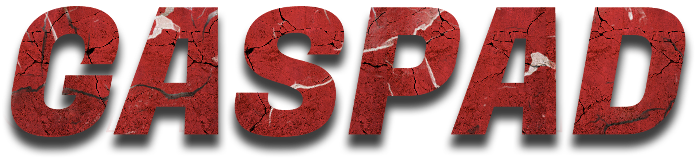

# 🔥 Getting Started

Welcome to GasPad, a decentralized launchpad for crypto projects that offers a suite of comprehensive features designed to empower creators and investors alike. Whether you're looking to launch your own token, host a private sale, or participate in a fair launch, GasPad has the tools and resources you need.

**1. Launchpad:** Our platform provides a seamless and user-friendly launchpad for crypto projects. With GasPad, you can launch your own token and initial token sale without any coding knowledge. Our intuitive interface guides you through the process, allowing you to design your own token in just a few clicks.

**2. Token Creation:** GasPad simplifies the process of token creation. Our platform offers a variety of token types to choose from, and our easy-to-use token creation tool allows you to customize your token's parameters to fit your project's needs.

**3. Fair Launch:** GasPad supports fair launches, ensuring that all participants have an equal opportunity to acquire tokens at the initial offering price. Our platform's automated systems manage the entire process, from token distribution to liquidity locking.

**4. Private Sale:** Looking to host a private sale? GasPad has got you covered. Our platform provides the tools you need to conduct a private sale, allowing you to raise funds from a select group of investors in a secure and transparent manner.

**5. Airdrop:** Reward your community with airdrops. GasPad's airdrop feature allows you to distribute tokens to your community members, fostering engagement and loyalty.

At GasPad, we're committed to providing a robust and reliable platform for launching and investing in crypto projects. Whether you're a project creator or an investor, GasPad is here to help you succeed in the dynamic world of cryptocurrency.

